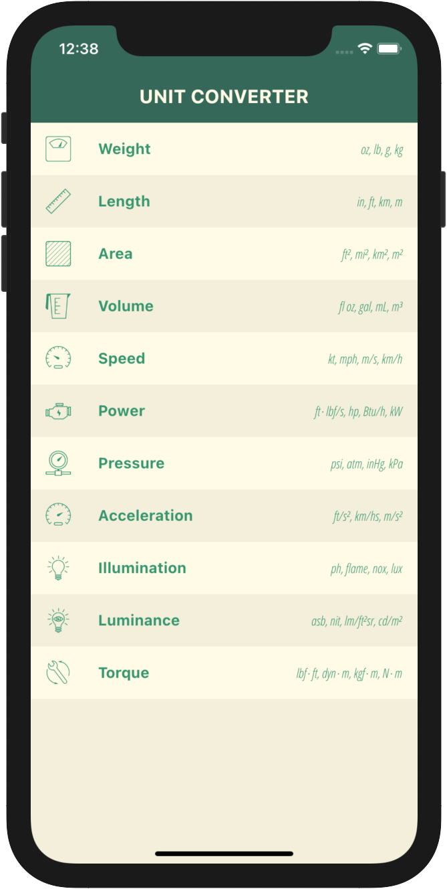
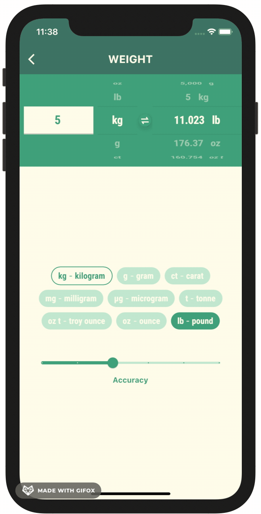

# unit converter 2021

Another flutter/ dart project uses bloc/ stream for state management and Reactive Programming.

Available on App Store and Play Store:

iOS app store: [https://apps.apple.com/app/id1515666116](https://apps.apple.com/app/id1515666116)

Andorid play store: [https://play.google.com/store/apps/details?id=org.unitsconversion.unitconverter](https://play.google.com/store/apps/details?id=org.unitsconversion.unitconverter)

 

## Reference

[Reactive Programming - Streams - BLoC - Practical Use Cases](https://www.didierboelens.com/2018/12/reactive-programming-streams-bloc-practical-use-cases/)

